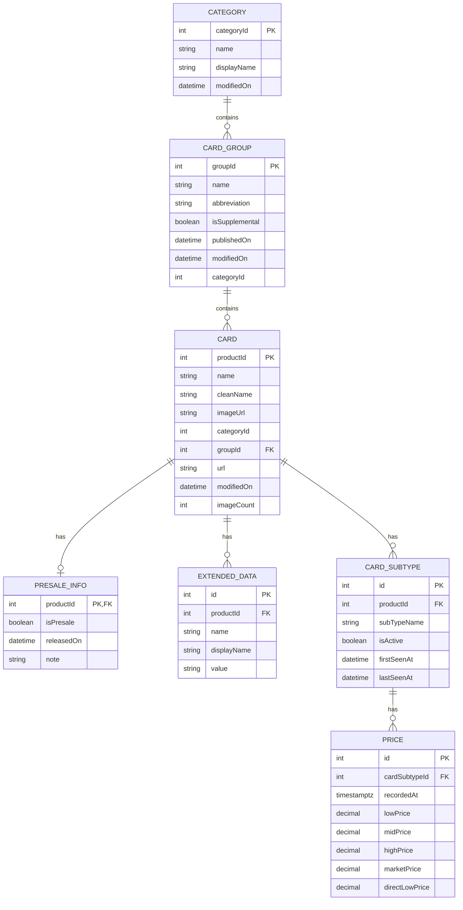

Thinking about this as the databse schema



This is a simplified schema for the TCG data.

There are only 4 Categories from tcgcsv.com that we care about:

categoryId | name
3 | Pokemon
85 | Pokemon Japan
68 | One-Piece
71 | Lorcana

## Seeding Categories

A seed script has been created at `apps/api/scripts/seed-categories.ts` that:
1. Fetches the latest category data from the [tcgcsv.com API](https://tcgcsv.com/tcgplayer/categories)
2. Filters to only the 4 categories we support (IDs: 3, 85, 68, 71)
3. Inserts them into the database with accurate `name`, `displayName`, and `modifiedOn` fields

To run the script:

```bash
# Development environment
cd apps/api
pnpm run db:seed:categories

# Production environment
cd apps/api
pnpm run db:seed:categories:prod
```

The script uses `onConflictDoNothing()` so it's safe to run multiple times - it won't create duplicates.